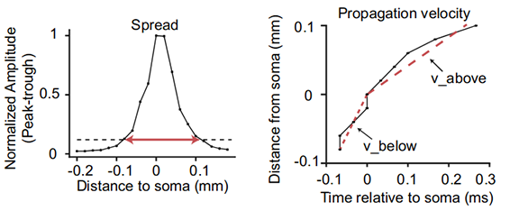

# waveform_feature_extraction
Python 2.7

Extract waveform features for 1D peak-channel waveform and the 2D waveform centered on the soma location.

**1D waveform features**: Waveform duration, peak-trough ratio, repolarization slope, and recovery slope.

**Example 2D waveform**: High-density recording probes can obtain an extracellular waveform profile of each neuron spread across channels

**2D waveform features**: Waveform spread, velocity above the soma, and velocity below the soma.

This is original Python 2.7 code for paper:
[Jia et al. (2019) "High-density extracellular probes reveal dendritic backpropagation and facilitate neuron classification." _J Neurophys_ **121**: 1831-1847](https://doi.org/10.1152/jn.00680.2018)

For Python 3 implementation, see [https://github.com/AllenInstitute/ecephys_spike_sorting/tree/master/ecephys_spike_sorting/modules/mean_waveforms]
